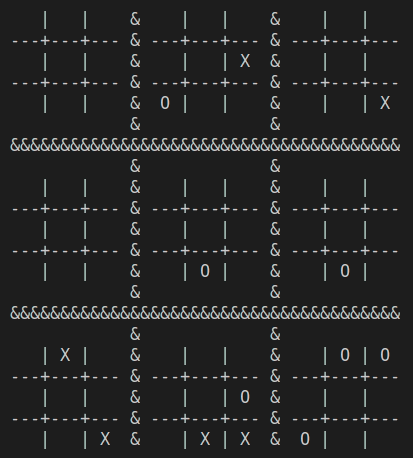
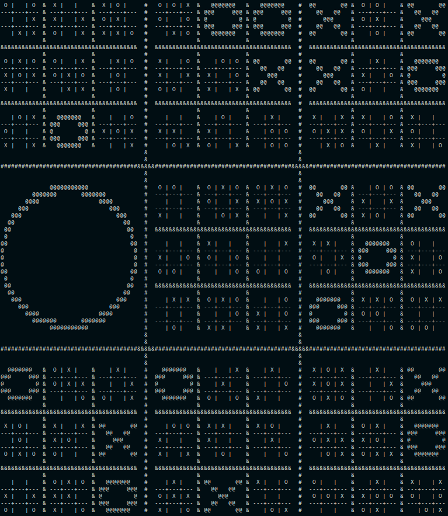

# Fractal Tic-Tac-Toe

Once, back in the high school, my friend introduced me an extended version of Tic-Tac-Toe game. 
I was very interested, since the basic version is trivial and boring. The key idea is that 
each cell of the `#` is replaced with yet another `#`, which acts like normal Tic-Tac-Toe game. 
Rules for making a move are following:

1. Each player draws a circle `O` or `X` in one of nine nested `#` (see picture below),
2. Choice of nested `#` by the player is enforced by the last opponent move in a such way:

    ```
    A player must draw character inside the nested # which is located in the same cell in an outer #, 
    than the cell which was marked by the opponent in the previous move in a nested #. 
    For example, if the last move was made inside outer cell NORTH-WEST, and SOUTH-EAST 
    in inner cell then the next move have to be made inside SOUTH-EAST outer cell.
    ```
3. If a nested `#` has been already decided (game in the `#` ended), player can choose 
    any nested `#` to make a move.
4. In the first move a player can choose any nested `#`.

In this project you can find implementation of the game, which I generalized to more than two levels, 
i.e. each nested `#`
can contain another `#` etc. For that reason, I called the game Fractal Tic-Tac-Toe.

Feel free to play MCTS agent on as many levels as you wish. Below you can see part of a match between two MCTS players.



An example of a board state in three levels game.


